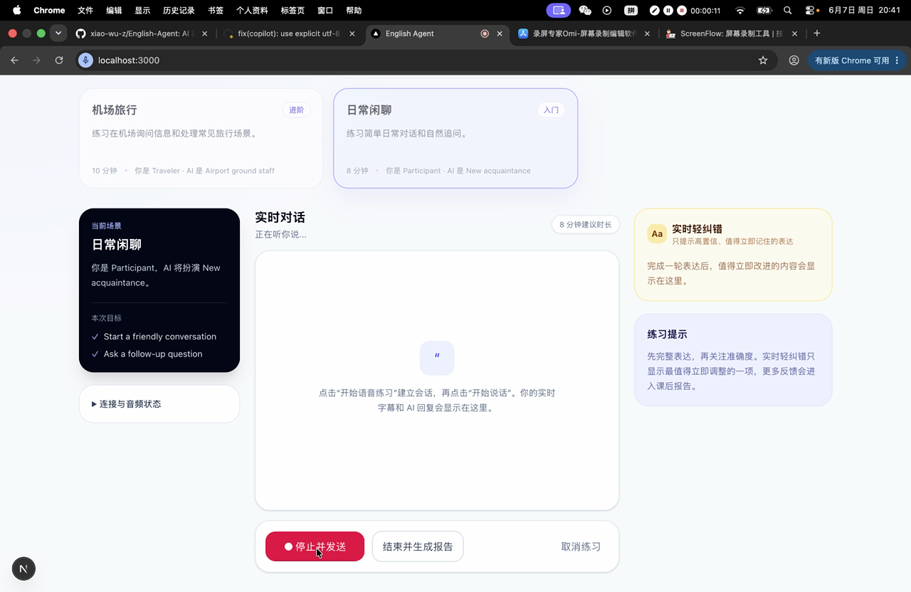

<h1 align="center">English Agent</h1>

<p align="center">
  一个面向真实场景的 AI 英语口语陪练，支持实时语音对话、轻量纠错和结构化练习报告。
</p>

<p align="center">
  
  
  
  
  <a href="README.md"></a>
</p>

English Agent 是一个用于真实情景英语练习的 MVP。它将可复用场景、文本与语音练习、实时模型连接、转录整理、克制的单轮纠错和课后报告整合为一套完整练习闭环。

项目遵循一个核心原则：**优先保持对话流畅，再把对话转化为可执行的学习反馈**。系统只展示有价值且置信度足够高的即时纠错，次要问题可以延迟到课后报告，避免每轮都打断用户。

## 演示视频

<p align="center">
  <a href="https://cdn.jsdelivr.net/gh/xiao-wu-z/English-Agent@demo-v1/docs/assets/demo.mp4">
    
  </a>
</p>

<p align="center">
  <a href="https://cdn.jsdelivr.net/gh/xiao-wu-z/English-Agent@demo-v1/docs/assets/demo.mp4"><strong>在线观看演示视频</strong></a>
  ·
  <a href="Screen-2026-06-07-204139.mp4">打开原始高清视频</a>
</p>

点击封面即可在浏览器中播放轻量 MP4，原始高清录屏会单独保留。

## 核心能力

| 能力 | 说明 |
| --- | --- |
| 场景化练习 | 内置日常闲聊、餐厅点餐、求职面试、机场旅行和商务会议五类场景。 |
| 文本与语音模式 | 可以先通过文本验证场景，也可以直接开始实时麦克风对话。 |
| 实时语音闭环 | 浏览器采集麦克风 PCM 音频并上传服务端，通过 SSE 接收模型事件，再按顺序调度返回的 PCM 音频。 |
| 稳定转录展示 | 合并增量和最终转录事件，避免把每个供应商 delta 都显示成独立消息。 |
| 实时轻纠错 | 对用户已完成的句子进行评估，只展示简短、明确、高置信度的纠错。 |
| 结构化练习报告 | 输出总分、维度分、优势、优先问题、纠正句、推荐表达和下一步练习建议。 |
| 三层 Prompt 架构 | 分离稳定教练规则、场景与 Skill 指令、有限运行时上下文，使 Prompt 可组合且与模型供应商解耦。 |
| 有界会话记忆 | 使用滚动摘要、近期轮次和经过筛选的 Badcase 提示，不持续回放完整会话。 |
| 场景化 Agent Skills | 将练习、纠错、评估和总结拆为独立结构化合同，并隔离 UI 与模型供应商细节。 |
| 恢复与诊断 | 提供心跳、超时、生命周期、播放队列和安全错误提示，便于排查实时会话问题。 |
| 模型供应商抽象 | 支持确定性的本地 Mock，也支持通过服务端 WebSocket 适配通义千问实时模型。 |

## 当前练习场景

| 场景 | 难度 | 练习重点 |
| --- | --- | --- |
| 日常闲聊 | 初级 | 问候、自然追问和日常交流 |
| 餐厅点餐 | 初级 | 点餐、询问菜品和礼貌提出要求 |
| 求职面试 | 中级 | 自我介绍、工作经验、个人优势和岗位相关回答 |
| 机场旅行 | 中级 | 询问信息并处理常见机场情景 |
| 商务会议 | 高级 | 工作汇报、提问、澄清和职业化回应 |

场景定义位于 [`src/scenarios`](src/scenarios)。每个场景通过经过校验的 JSON Schema 提供背景、角色、目标、关键里程碑、推荐表达和 Skill 绑定。

## 实时语音链路

```text
浏览器麦克风
  -> 采集 PCM16 单声道 16 kHz 音频
  -> 通过 POST 上传音频分片到 Next.js 服务端
  -> 连接 Qwen Realtime WebSocket
  -> 接收模型转录和音频事件
  -> 服务端转换为统一应用事件
  -> 通过 SSE 推送到浏览器
  -> 合并转录 + 按顺序播放 PCM
  -> 对选中的最终用户句子发送 correction.ready
  -> 结束会话后生成结构化报告
```

浏览器不会拿到模型供应商 API Key。供应商鉴权、提示词组合、转录保存、纠错决策和报告生成都保留在服务端。

## 快速开始

### 环境要求

- Node.js 20 或更高版本
- npm
- 支持麦克风权限的现代 Chromium 浏览器
- 仅在使用 Qwen 供应商时需要 DashScope/Qwen API Key

### 安装并启动

```bash
npm install
npm run dev
```

浏览器访问 [http://localhost:3000](http://localhost:3000)。

默认供应商为 `mock`，不配置外部 API Key 也可以体验应用和开发流程。

## 模型配置

在项目根目录创建本地 `.env.local` 文件。所有环境变量文件都已被 `.gitignore` 排除。

### 本地 Mock 供应商

```bash
MODEL_PROVIDER=mock
```

该模式适合 UI 开发、合同测试和可重复的本地流程验证。

### Qwen 实时供应商

```bash
MODEL_PROVIDER=qwen
DASHSCOPE_API_KEY=your_dashscope_api_key

# 可选覆盖项
QWEN_REALTIME_MODEL=qwen3.5-omni-plus-realtime
# QWEN_REALTIME_URL=wss://your-compatible-realtime-endpoint
```

也可以使用 `QWEN_API_KEY` 代替 `DASHSCOPE_API_KEY`。所有供应商凭据都必须保留在服务端，不要通过 `NEXT_PUBLIC_*` 环境变量暴露。

## 使用流程

1. 选择一个练习场景。
2. 选择**文本**或**语音**模式。
3. 开始练习。
4. 语音模式下授权麦克风并自然说话。
5. 查看整理后的用户与 AI 转录，同时收听按顺序播放的模型语音。
6. 出现轻纠错卡片时，将其作为即时参考。
7. 结束会话，生成结构化练习报告。

诊断面板主要用于开发和故障排查。它可以展示安全的连接、生命周期、事件和播放状态，但不得包含原始音频、凭据、供应商鉴权数据或模型隐藏推理。

## 练习报告

报告数据合同包含：

- 总分
- 流利度、发音清晰度、语法、词汇、表达和连贯性评分
- 优势和优先改进问题
- 用户原句、纠正句及解释
- 推荐表达
- 下一次练习建议

生成报告前，服务端会等待尚未处理完的最终转录，降低遗漏用户最后一句话的概率。

## 三层 Prompt 架构

English Agent 不维护一个不断膨胀、难以控制的大 Prompt，而是把每次模型请求显式拆为三层上下文：

| 层级 | 内容 | 作用 |
| --- | --- | --- |
| **Tier 1：核心教练规则** | 稳定的安全与教学规则 | 保证教练表达简洁、反馈有证据、以学习者为中心，并禁止输出隐藏推理或供应商凭据。 |
| **Tier 2：场景与当前 Skill** | 场景角色、目标、约束、当前 Skill 及预期输出 Schema | 在不复制全局规则、不绑定特定模型供应商的情况下切换教学任务。 |
| **Tier 3：运行时上下文** | 会话记忆快照、相关 Badcase 提示和当前任务输入 | 只提供当前模型调用真正需要的会话证据。 |

```text
Tier 1：稳定教学策略
          +
Tier 2：场景 + 单个当前 Skill + 输出合同
          +
Tier 3：有界记忆 + Badcase 提示 + 当前输入
          |
          v
与供应商无关的消息
          |
          v
Mock 或 Qwen 模型供应商
          |
          v
通过 Zod 校验的结构化输出
```

Prompt 构建器会拒绝在 Prompt 输入中出现供应商传输配置或凭据。同时记录场景版本、当前 Skill、包含的层级、上下文大小和预期输出 Schema 等元数据，便于检查与测试 Prompt 组合过程。

## 记忆设计

记忆模型采用有界设计，在保留连贯陪练所需上下文的同时，避免长会话导致 Prompt 无限增长。

### 会话内记忆

- **滚动摘要：**压缩较早的会话上下文。
- **近期轮次：**保留最近的用户与教练交流，Prompt 默认只使用最近六轮。
- **当前用户输入：**当前正在处理的用户消息或最终语音转录。
- **压缩信号：**当会话超过八轮或转录文本约 12,000 个字符时，可以进入压缩流程。

### 学习反馈记忆

Prompt 层最多加入三条相关 Badcase 提示。这些提示是从已知纠错、评估或总结失败中提炼出的简短安全经验，用于指导当前 Skill，但不会把原始日志、密钥、音频或隐藏推理注入模型请求。

### 本地练习历史

仓库已经实现带版本号的 `localStorage` Repository，用于保存经过校验的练习会话，并生成分数或总结预览。写入前会拒绝凭据、原始音频和隐藏推理字段，同时使用有界策略清理保留数据。

该存储模块是已经实现的基础能力，但完整的历史浏览和跨会话个性化尚未接入当前 MVP 主界面。数据库同步和跨设备学习者记忆仍属于后续路线图。

## Agent Skills

学习行为被拆分为 [`agent-skills`](agent-skills) 下四个任务型 Skill。每次模型请求只加载当前需要的 Skill。

| Skill | 职责 | 结构化输出 |
| --- | --- | --- |
| `english-practice` | 保持场景角色、提高用户开口时间，并选择下一步简短对话动作 | `PracticeTurnGuidance` |
| `english-correction` | 按照“少而准”策略决定问题应该展示、抑制还是延迟到总结 | `CorrectionItem` |
| `english-assessment` | 输出有证据、非官方的学习评分、置信度、风险和建议动作 | `AssessmentResult` |
| `english-summary` | 将完整会话整理为优势、优先问题、纠正句、推荐表达和下一步练习 | `PracticeSummary` |

每个 Skill 都由可阅读的 `SKILL.md` 定义，注册到一个任务和一个预期 Schema，再通过统一的供应商无关运行时执行：

```text
场景 Skill 绑定
  -> 加载一个 SKILL.md
  -> 与三层 Prompt 合并
  -> 调用选定的模型供应商
  -> 解析声明的 Zod 输出合同
  -> 将结果交给练习、纠错、评估或报告流程
```

这种拆分使实时对话指导保持简短，避免纠错逻辑接管角色扮演，并允许独立演进评估或总结行为，而不需要重写语音传输层。

## 项目架构

```text
src/
├── app/
│   ├── api/practice-sessions/          # 文本练习 HTTP 路由
│   ├── api/realtime-practice-sessions/ # 语音创建、音频、SSE、结束路由
│   └── page.tsx                        # MVP 应用外壳
├── components/voice-practice/          # 场景、转录、纠错、控制、
│                                       # 诊断和报告界面
├── lib/
│   ├── agent-skills/                   # 练习、纠错、评估和总结运行时
│   ├── agent-skill-contracts/          # 模型结构化输出 Schema
│   ├── model-providers/                # Mock 与 Qwen 供应商适配
│   ├── pcm-audio-capture/              # 浏览器 PCM16 麦克风采集
│   ├── practice-history/               # 带版本的本地历史 Repository
│   ├── prompt-context/                 # 三层 Prompt 组合
│   ├── qwen-pcm-playback/              # 输出音频顺序调度
│   ├── realtime-voice-flow/            # 服务端实时语音编排
│   ├── realtime-voice-recovery/        # 超时与恢复策略
│   ├── realtime-voice-ui/              # 转录和纠错 UI 决策
│   ├── text-practice-flow/             # 文本会话编排
│   ├── voice-skill-flow/               # 最终句纠错和报告工作流
│   └── voice-practice-client/          # 浏览器端合同与辅助模块
└── scenarios/                          # 已校验的练习场景定义
```

### 模块边界

- **UI 负责交互状态：**场景选择、模式、麦克风状态、转录展示、纠错卡片和报告渲染。
- **应用流程负责生命周期：**创建会话、接收音频、推送 SSE、处理最终句和结束会话。
- **Agent Skills 负责学习行为：**练习提示、轻纠错、评估和总结生成。
- **Provider 负责传输细节：**Mock 行为或 Qwen WebSocket 协议转换。
- **Zod 合同保护模块边界：**API 数据、供应商事件、应用事件、纠错和报告在使用前都要完成解析。

## API 概览

| 方法 | 路径 | 用途 |
| --- | --- | --- |
| `POST` | `/api/practice-sessions` | 创建文本练习会话 |
| `GET` | `/api/practice-sessions/:sessionId` | 读取文本会话状态 |
| `POST` | `/api/practice-sessions/:sessionId/turns` | 提交用户文本轮次 |
| `POST` | `/api/practice-sessions/:sessionId/end` | 结束文本练习并生成报告 |
| `POST` | `/api/realtime-practice-sessions` | 创建实时语音会话 |
| `POST` | `/api/realtime-practice-sessions/:sessionId/audio` | 上传 PCM 音频分片 |
| `GET` | `/api/realtime-practice-sessions/:sessionId/events` | 订阅标准化 SSE 事件 |
| `POST` | `/api/realtime-practice-sessions/:sessionId/end` | 结束语音练习并生成报告 |

实时 SSE 流可以包含生命周期事件、转录增量、最终转录、输出音频分片、`correction.ready`、安全工作流错误和 `session.closed`。

## 数据与隐私

- 应用会将麦克风原始音频转发给实时模型处理，但不会主动保存原始音频。
- API Key 只保存在服务端环境变量中。
- 纠错、报告、诊断和用户可见错误不得包含原始或 Base64 音频、鉴权请求头或隐藏推理。
- 仓库已经提供本地历史记录的数据合同和存储工具，但持久化多端账户和数据库同步不属于当前 MVP。
- 生产部署还需要增加鉴权、限流、数据保留规则、滥用防护、可观测性和明确的隐私政策。

## 开发命令

```bash
npm run dev      # 启动开发服务器
npm run test     # 运行 Node 测试
npm run lint     # 运行 ESLint
npm run build    # 创建生产构建
npm run start    # 启动生产服务器
```

测试文件以 `*.test.ts` 形式与模块放在一起，覆盖 Schema、供应商适配、场景校验、转录合并、实时编排、纠错行为、恢复策略、音频合同和报告生成。

## 项目文档

| 文档 | 用途 |
| --- | --- |
| [产品与架构设计](docs/superpowers/specs/2026-06-06-ai-english-speaking-coach-design.md) | 原始产品范围、学习闭环和系统设计 |
| [中文产品与架构设计](docs/superpowers/specs/2026-06-06-ai-english-speaking-coach-design.zh.md) | 原始设计的中文版本 |
| [语音接入与 UI 设计](docs/superpowers/specs/2026-06-07-voice-practice-integration-ui-design.md) | 当前实时语音、纠错、报告和 UI 接入决策 |
| [语音接入实施计划](docs/superpowers/plans/2026-06-07-voice-practice-integration-ui.md) | 实施任务与验证步骤 |

## MVP 状态与路线图

当前 MVP 已实现：

- 五个经过校验的练习场景
- 文本和实时语音练习
- Mock 与 Qwen 模型供应商适配
- 服务端 SSE 事件标准化
- PCM 顺序播放和转录合并
- 单轮实时轻纠错
- 结构化课后报告
- 实时恢复和诊断状态

后续重点：

- 生产级鉴权和用户档案
- 数据库支持的持久化练习历史
- 跨设备进度追踪和学习分析
- 更多场景和可配置难度
- 专项发音评分
- 更广泛的浏览器和移动设备验证
- 生产监控、配额和隐私控制

## 参与开发

修改行为前，请先阅读 [`docs/superpowers`](docs/superpowers) 下对应的设计与实施文档。供应商细节应保留在 Provider 接口后，新结构化数据应使用 Zod 校验，并在受影响模块旁添加针对性测试。

当前仓库没有许可证文件。在明确添加许可证前，不应默认拥有再分发或商业使用权限。
